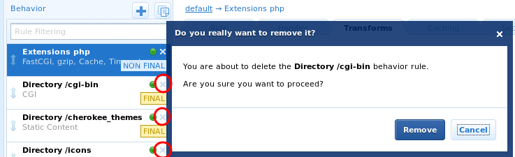

<head>
<meta http-equiv="content-type" content="text/html;charset=utf-8" />
<link rel="stylesheet" type="text/css" href="markdown.css"></link>
</head>
<!-- build html via 'pandoc index_de.md -o index_de.html'-->

# Installieren von Moodle auf Ubuntu Server 12.04 LTS

1. Verbinden mit dem Server über SSH:

	```bash
	ssh <Nutzername>@<IP-Adresse> -L 9090:localhost:9090
	```
	
	- So könnte dies z.B. aussehen:
	<div></div>
	- Der Parameter '-L' am Ende sorgt dafür, dass der Port 9090 weitergeleitet wird, da sich Cherokee über das Web-Interface nur über Localhost konfigurieren lässt

2. Installieren der notwendigen Pakete (Cherokee, MySQL, PHP) über die Ubuntu Paketverwaltung:

	```bash
	sudo apt-get install mysql-server php5 php5-mysql php5-curl php5-cgi php5-xmlrpc php5-gd php5-intl cherokee
	```

	- Sie werden während der Installation nach einem Passwort für MySQL gefragt:
	<div></div>

3. Einrichten einer Datenbank und eines Nutzers für Moodle in MySQL:

	```bash
	mysql -u root -p
	mysql> CREATE DATABASE moodle DEFAULT CHARACTER SET utf8 DEFAULT COLLATE utf8_general_ci;
	mysql> create user 'moodle'@'localhost' identified by '<Passwort>';
	mysql> grant all on moodle.* to moodle@localhost;
	```

	- So könnte dies z.B. aussehen:
	<div></div>

4. Hochladen der Moodle-Dateien auf den Server:

	- Die einfachste Möglichkeit ist der Upload über das Programm [Filezilla](http://filezilla-project.org/): <div></div>
	- Eine wesentlich schnellere und für Entwickler komfortablere Alternative besteht möglicherweise darin, die Daten via SSH-Shell direkt aus einem GIT-Repository zu klonen (mitunter verbieten Firewalleinstellungen dies):

		```bash
		sudo apt-get install git && git clone https://github.com/kyro46/elateXam.git
		```

5. Starten des Cherokee Admin-Webinterfaces:

	```bash
	sudo cherokee-admin
	```

	- Es werden Ihnen die Zugangsdaten und der Link zum Webinterface angezeigt, welche Sie in den Browser kopieren können:
	<div></div>
	- Aus Sicherheitsgründen ist der Zugriff auf das Webinterface nur solange möglich, bis Sie den Prozess beenden (beispielsweise mit &lt;Strg&gt;+&lt;C&gt; oder durch einem Reboot).
	- Auch wird das Passwort jedes Mal neu generiert, Sie müssen es sich also nicht merken.

6. Einrichten der PHP-Umgebung in Cherokee:
	- Unter VServer-Einstellungen (<strong style="color:red">1</strong>) auf Rule-Management klicken (<strong style="color:red">2</strong>): <div></div>
	- Unter 'Languages' PHP auswählen und hinzufügen: <div></div>
	- Die vordefinierten Behaviours werden nicht gebraucht und können entfernt werden (optional): <div></div>
	- Im Behaviour 'Default' sollte aus Sicherheitsgründen 'Directory Listing' ausgeschaltet werden: <div></div>
	- Unter dem Reiter 'Basics' (<strong style="color:red">2</strong>) in den VServer-Einstellungen (<strong style="color:red">1</strong>) sollte sichergestellt werden, dass der Pfad eingestellt ist, in dem Moodle liegt (<strong style="color:red">3</strong>); außerdem sollte eingestellt sein, dass nur PHP-Dateien als Index-Dateien verwendet werden (<strong style="color:red">4</strong>): <div></div>
	- Unter dem Reiter 'Security' (<strong style="color:red">1</strong>) können Sie die Einstellungen für SSL anpassen: <div></div>
	- Zuguterletzt müssen die Einstellungen noch gespeichert (<strong style="color:red">1</strong>) und der Server neu gestartet (<strong style="color:red">2</strong>) werden: <div></div>

7. Einrichten von Moodle:
	- Moodle lässt sich nun unter der Adresse des Servers erreichen: <div></div>
	- Im nächsten Schritt müssen Sie einen Ort für den Ordner *moodledata* bestimmen: <div></div>
		- Wichtig ist, dass der Ordner existiert und das der Nutzer *www-data* Schreibrechte für diesen Ordner besitzt. Dies erreichen Sie mit den folgenden Anweisungen:

			```bash
			sudo mkdir <Pfad-zum-Moodledata-Verzeichnis>
			sudo chown -R www-data <Pfad-zum-Moodledata-Verzeichnis>
			```

	- Als nächstes müssen die Zugangsdaten für die MySQL-Datenbank eingegeben werden (siehe Abschnitt 3): <div></div>
	- Aus Sicherheitserwägungen ist es sinnvoll, dem Nutzer *www-data* **keine** Schreibrechte für den *moodle*-Ordner zu geben. Im nächsten Schritt muss deshalb eine Datei *config.php* erstellt werden, in welche die Inhalte, die während der Installation angezeigt werden, hineinkopiert werden: <div></div>
	- In den darauffolgenden Schritten können Sie die gewünschten Einstellungen vornehmen. Der schwierige Teil ist vorbei.


8. Wartung des Servers:
	- Um die Sicherheit zu gewährleisten, sollten in regelmäßigen Abständen Updates durchgeführt werden:

		```bash
		sudo apt-get update && sudo apt-get upgrade
		```
